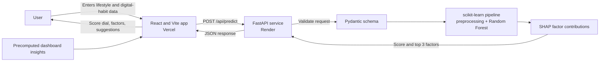

# MentaScore

AI-based mental health score prediction system. MentaScore estimates a well-being score (out of 10)
from lifestyle, behavioural, academic and social factors, and explains which factors help or hold
the score back. It pairs a React frontend with a FastAPI prediction service and a Random Forest
model explained with SHAP.

**Live demo:** [mentascore.vercel.app](https://mentascore.vercel.app/) 

**API docs:** [mentascore-backend.onrender.com/docs](https://mentascore-backend.onrender.com/docs)

> The backend runs on Render's free tier and sleeps when idle. The first request can take 30-60
> seconds; later requests are fast.

| Layer | Technology |
|---|---|
| Frontend | React 18, Vite, Recharts (Vercel) |
| API | Python 3.11, FastAPI, Pydantic, Uvicorn (Render) |
| Model and explanations | scikit-learn Random Forest pipeline, SHAP TreeExplainer |
| Data and training | pandas, NumPy, Matplotlib, Seaborn, Jupyter |

> **Well-being notice:** MentaScore is for awareness and self-reflection only. It is not a medical
> device or mental-health screening tool, and it is not a substitute for professional care. Scores
> and suggestions are estimates based on survey data and must not be used to diagnose or treat any
> condition.

## How it works



1. The React form collects 12 inputs and sends them to `/api/predict` through
   `frontend/src/services/predictionService.js`, the only file that talks to the backend.
2. The API validates the request with Pydantic (types, ranges, allowed categories, no unknown fields).
3. The saved scikit-learn pipeline (preprocessing + Random Forest) predicts the score. The pipeline
   is loaded once at startup, so training and serving use identical preprocessing.
4. SHAP `TreeExplainer` computes each feature's contribution. One-hot columns are summed back into
   five lifestyle factors (Sleep, Stress level, Screen time, Study hours, Physical activity) and the
   three strongest are returned. Positive values help the score; negative values hold it back.
5. The frontend shows the score dial, the factors and rule-based wellness suggestions.

## Machine learning

**Dataset:** the Kaggle survey dataset "Student Social Media And Mental Health Impact"
(5,000 rows, 13 columns; 4,998 rows after removing 2 duplicates). Target: `Mental_Health_Score`.

**Pipeline** (`backend/notebooks/Mental_Health_Score_model.ipynb`):

| Step | Detail |
|---|---|
| Cleaning | Drop duplicates, clip negative physical-activity values, IQR outlier check |
| Feature engineering | Keep the 9 most frequent countries, group the rest as `Other` |
| Preprocessing | `ColumnTransformer`: log1p + scaling for skewed `Study_Hours`, scaling for other numeric columns, ordinal encoding for `Stress_Level`, one-hot encoding for categorical columns |
| Split | 70% train / 30% test, `random_state=42` |
| Models | Linear Regression baseline, Random Forest, Random Forest tuned with `RandomizedSearchCV` (5-fold) |

**Results (test set):**

| Model | R² | MAE | RMSE |
|---|---|---|---|
| Linear Regression | 0.740 | 0.536 | 0.676 |
| Random Forest (default, **saved model**) | 0.878 | 0.347 | 0.464 |
| Random Forest (tuned) | 0.865 | 0.369 | 0.487 |

Random Forest captures non-linear relationships between habits and score. The tuned model has less
over-fitting (train R² 0.955 vs 0.981) but a slightly lower test R², so the default Random Forest
is the saved model. Strongest correlations with the score: daily usage -0.82, daily unlocks -0.79,
sleep +0.77, study hours +0.75.

## Project structure

```text
MentaScore/
├── backend/
│   ├── app/                  # FastAPI routes, request schemas, model inference + SHAP
│   ├── data/                 # Training survey dataset (Kaggle)
│   ├── models/               # Serialized trained pipeline (.pkl)
│   ├── notebooks/            # EDA and model training notebook
│   ├── tests/                # API tests (pytest)
│   └── requirements.txt
├── frontend/
│   ├── src/
│   │   ├── components/       # Form, result, navigation, dashboard UI
│   │   ├── data/             # Precomputed dashboard insights
│   │   ├── pages/            # Prediction and dashboard pages
│   │   ├── services/         # Backend prediction requests
│   │   └── utils/            # Wellness suggestions and score labels
│   └── package.json
└── README.md
```

## Run locally

Start the backend and frontend in separate terminals.

### Backend

From the repository root:

```powershell
py -3.11 -m venv venv
.\venv\Scripts\python.exe -m pip install -r backend\requirements.txt
Set-Location backend
..\venv\Scripts\python.exe -m uvicorn app.main:app --reload
```

The API runs at `http://localhost:8000`. Interactive docs are at `http://localhost:8000/docs`.

Run the tests from `backend/`:

```powershell
..\venv\Scripts\python.exe -m pip install pytest httpx
..\venv\Scripts\python.exe -m pytest tests
```

### Frontend

In a second terminal, from the repository root:

```powershell
Set-Location frontend
Copy-Item .env.example .env
npm ci
npm run dev
```

Open the local URL printed by Vite (default `http://localhost:5173`). `.env.example` points the
frontend at `http://localhost:8000`; `frontend/.env.production` points production builds at the
Render API.

### Deploy

- **Frontend (Vercel):** root directory `frontend`, build command `npm ci && npm run build`,
  output directory `dist`. `VITE_API_BASE_URL` is embedded at build time.
- **Backend (Render):** Python 3.11 web service, root directory `backend`, start command
  `uvicorn app.main:app --host 0.0.0.0 --port $PORT`.

## Prediction API

| Endpoint | Purpose |
|---|---|
| `POST /api/predict` | Returns the estimated score and top 3 factor contributions |
| `GET /health` | Health check (returns `{"status": "ok"}`) |
| `GET /docs` | Interactive OpenAPI documentation |

### `POST /api/predict`

| Field | Type | Accepted values or range |
|---|---|---|
| `age` | integer | 13-100 |
| `gender` | string | `Male`, `Female` |
| `country` | string | Non-empty. Countries outside the model's top 9 are treated as `Other` |
| `academicLevel` | string | `High School`, `Undergraduate`, `Graduate` |
| `mostUsedPlatform` | string | `Facebook`, `Instagram`, `KakaoTalk`, `LINE`, `LinkedIn`, `Snapchat`, `TikTok`, `Twitter`, `VKontakte`, `WeChat`, `WhatsApp`, `YouTube` |
| `purposeOfUse` | string | `Education`, `Entertainment`, `Networking`, `News` |
| `avgDailyUsageHours` | number | 0-24 |
| `dailyUnlocks` | integer | 0-1000 |
| `studyHours` | number | 0-24 |
| `physicalActivityHours` | number | 0-24 |
| `sleepHoursPerNight` | number | 0-24 |
| `stressLevel` | string | `Low`, `Medium`, `High`, `Very High` |

Example request:

```json
{
  "age": 20,
  "gender": "Female",
  "country": "India",
  "academicLevel": "Undergraduate",
  "mostUsedPlatform": "Instagram",
  "purposeOfUse": "Entertainment",
  "avgDailyUsageHours": 5,
  "dailyUnlocks": 106,
  "studyHours": 3,
  "physicalActivityHours": 1,
  "sleepHoursPerNight": 6,
  "stressLevel": "High"
}
```

Example response:

```json
{
  "score": 5.7,
  "contributions": [
    { "label": "Sleep", "value": -0.315 },
    { "label": "Screen time", "value": -0.174 },
    { "label": "Physical activity", "value": -0.095 }
  ],
  "source": "backend-model"
}
```

`value` is the SHAP contribution in score points relative to the average prediction: negative
values hold the score back, positive values help it. Requests with unknown fields, out-of-range
numbers or unknown categories are rejected with HTTP 422. The API stores no user data.

## Retrain the model

Open `backend/notebooks/Mental_Health_Score_model.ipynb` in Jupyter or VS Code and run all cells.
It reads the CSV in `backend/data/` and writes the pipeline to
`backend/models/Mental_Health_Model.pkl`. The pickle depends on the scikit-learn version, so keep
`requirements.txt` (scikit-learn 1.6.1) in sync with the version used for training. The dashboard
data in `frontend/src/data/edaInsights.json` is precomputed; regenerate it if the dataset changes.

## Limitations

- Predictions reflect patterns in one survey dataset and can inherit its limitations or biases; the
  score has not been validated by clinicians.
- Train R² (0.98) is much higher than test R² (0.88), so the model over-fits somewhat.
- Explanations cover five lifestyle factors; age, daily unlocks and categorical features are not
  shown individually.
- The dashboard statistics are precomputed and are not recalculated by the frontend.
- The free Render tier has cold starts after inactivity.

## Future work

Global SHAP plots for all features, larger and more diverse data with expert validation, score
tracking over time, a mobile version and more languages.
