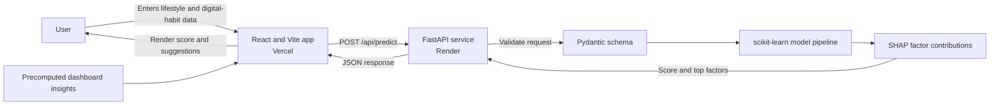

# MentaScore

An educational well-being dashboard that estimates a self-reflection score from lifestyle and
digital-habit inputs. MentaScore pairs a React frontend with a FastAPI prediction service and
provides a concise breakdown of influential factors.

<p align="center">
  <a href="https://mentascore.vercel.app/"><strong>Frontend</strong></a>
  &nbsp;·&nbsp;
  <a href="https://mentascore-backend.onrender.com/"><strong>Backend</strong></a>
</p>

| Layer | Technology |
|---|---|
| Frontend | React 18, Vite, Recharts |
| API | Python 3.11, FastAPI, Uvicorn |
| Prediction and explanations | scikit-learn, SHAP |
| Hosting | Vercel (frontend), Render (API) |

> **Well-being notice:** MentaScore is for awareness and self-reflection only. It is not a medical
> device or mental-health screening tool, and it is not a substitute for professional care. Scores
> and suggestions are estimates based on survey data and must not be used to diagnose or treat any
> condition.

## Architecture



The prediction API validates each request, runs the saved model pipeline, and returns an estimated
score with up to three grouped SHAP contributions. Dashboard visualizations use precomputed project
statistics bundled with the frontend.

## Features

- Enter demographic, digital-habit, and lifestyle information to request a prediction.
- View an estimated score and a short explanation of its strongest contributing factors.
- Explore dataset statistics through dashboard visualizations.
- Train and save the model using the included Jupyter notebook.

## Project structure

```text
MentaScore/
├── backend/
│   ├── app/                  # FastAPI routes, request schemas, model inference
│   ├── data/                 # Training survey dataset
│   ├── models/               # Serialized trained model
│   ├── notebooks/            # Model training notebook
│   └── requirements.txt      # Python dependencies
├── frontend/
│   ├── src/
│   │   ├── components/       # Form, result, navigation, and dashboard UI
│   │   ├── data/             # Precomputed dashboard insights
│   │   ├── pages/            # Prediction and dashboard pages
│   │   ├── services/         # Backend prediction requests
│   │   └── utils/            # Wellness suggestions and score labels
│   ├── .env.example          # Example frontend environment configuration
│   └── package.json
└── README.md
```

## Requirements

- Node.js and npm
- Python 3.11
- The model file at `backend/models/Mental_Health_Model.pkl`
- The training dataset at `backend/data/Student Social Media And Mental Health Impact.csv`

## Run locally

Start the backend and frontend in separate terminals.

### 1. Set up and start the backend

From the repository root, create a virtual environment and install the Python dependencies:

```powershell
py -3.11 -m venv venv
.\venv\Scripts\python.exe -m pip install -r backend\requirements.txt
```

Start the API from the `backend` directory:

```powershell
Set-Location backend
..\venv\Scripts\python.exe -m uvicorn app.main:app --reload
```

The backend service runs at `http://localhost:8000` when started locally.

### 2. Set up and start the frontend

In a second terminal, from the repository root:

```powershell
Set-Location frontend
Copy-Item .env.example .env
npm ci
npm run dev
```

Open the local URL printed by Vite (by default, `http://localhost:5173`). The example environment
file points the frontend at `http://localhost:8000`. This is appropriate when running the backend
locally. The checked-in `frontend/.env.production` points production builds at the deployed Render
API; override `VITE_API_BASE_URL` in your hosting provider's build environment if you use a
different backend URL.

### Deploy the frontend

The frontend is a static Vite app. In your frontend hosting provider, configure:

- **Root directory:** `frontend`
- **Build command:** `npm ci && npm run build`
- **Publish/output directory:** `dist`

The production build uses `frontend/.env.production` and calls
`https://mentascore-backend.onrender.com/api/predict`. `VITE_API_BASE_URL` is embedded into the
frontend at build time, so set or change it before building/redeploying. To build and preview locally,
run these commands from `frontend/`:

```powershell
npm ci
npm run build
npm run preview
```

The production files are generated in `frontend/dist/`.

The prediction API is publicly accessible and does not use cookie-based authentication. Its CORS
configuration allows cross-origin POST requests so the Vercel frontend can call the Render API.

## Prediction API

### `POST /api/predict`

The endpoint accepts JSON with these fields:

| Field | Type | Accepted values or range |
|---|---|---|
| `age` | integer | 13–100 |
| `gender` | string | `Male`, `Female` |
| `country` | string | Non-empty |
| `academicLevel` | string | `High School`, `Undergraduate`, `Graduate` |
| `mostUsedPlatform` | string | `Facebook`, `Instagram`, `KakaoTalk`, `LINE`, `LinkedIn`, `Snapchat`, `TikTok`, `Twitter`, `VKontakte`, `WeChat`, `WhatsApp`, `YouTube` |
| `purposeOfUse` | string | `Education`, `Entertainment`, `Networking`, `News` |
| `avgDailyUsageHours` | number | 0–24 |
| `dailyUnlocks` | integer | 0–1000 |
| `studyHours` | number | 0–24 |
| `physicalActivityHours` | number | 0–24 |
| `sleepHoursPerNight` | number | 0–24 |
| `stressLevel` | string | `Low`, `Medium`, `High`, `Very High` |

Example request:

```json
{
  "age": 21,
  "gender": "Female",
  "country": "India",
  "academicLevel": "Undergraduate",
  "mostUsedPlatform": "Instagram",
  "purposeOfUse": "Entertainment",
  "avgDailyUsageHours": 4.5,
  "dailyUnlocks": 150,
  "studyHours": 3,
  "physicalActivityHours": 1.5,
  "sleepHoursPerNight": 7,
  "stressLevel": "Medium"
}
```

The response contains the estimated score, up to three grouped factor contributions, and the
prediction source:

```json
{
  "score": 6.8,
  "contributions": [
    { "label": "Sleep", "value": 0.31 },
    { "label": "Stress level", "value": -0.18 },
    { "label": "Screen time", "value": -0.12 }
  ],
  "source": "backend-model"
}
```

The request schema rejects unknown fields and validates the stated ranges and categorical values.
The backend currently allows cross-origin requests from browser frontends. If you later restrict
CORS to specific domains, include your deployed frontend origin and any local development origins.

## Train the model

The training notebook is `backend/notebooks/Mental_Health_Score_model.ipynb`. Create the Python
environment and install dependencies as described above, then open the notebook in Jupyter or
VS Code and run its cells. The notebook reads the CSV in `backend/data/` and writes the trained
pipeline to `backend/models/Mental_Health_Model.pkl`.

After changing the training data or notebook, regenerate the saved model before starting the API.
The dashboard data in `frontend/src/data/edaInsights.json` is precomputed; update it separately
if you change the source dataset and want the dashboard to reflect those changes.

## Limitations

- Predictions reflect patterns in the available survey dataset and can inherit its limitations
  or biases.
- The returned score is an estimate, not a clinical measurement or diagnosis.
- The dashboard statistics are precomputed and are not recalculated by the frontend.
- The API loads the serialized model when the backend starts; the model file must be present and
  compatible with the installed Python packages.
